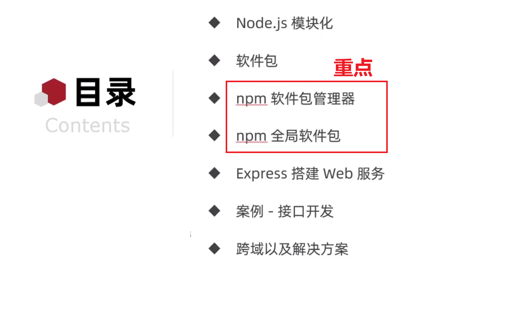
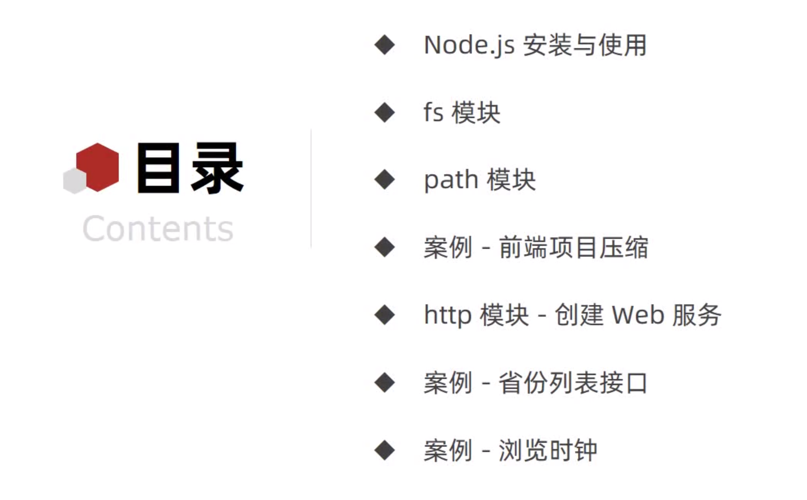
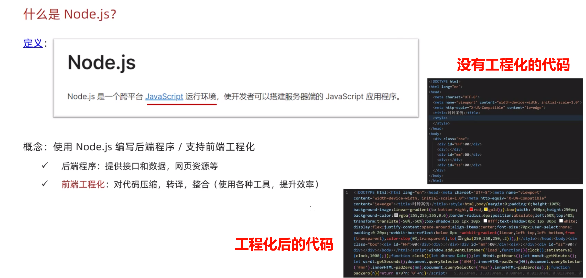
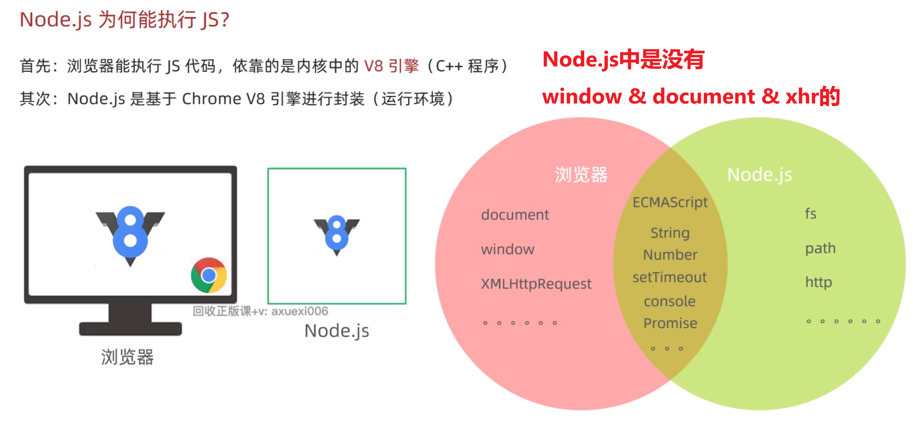
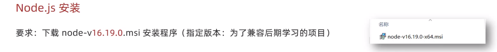
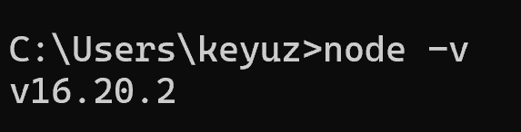
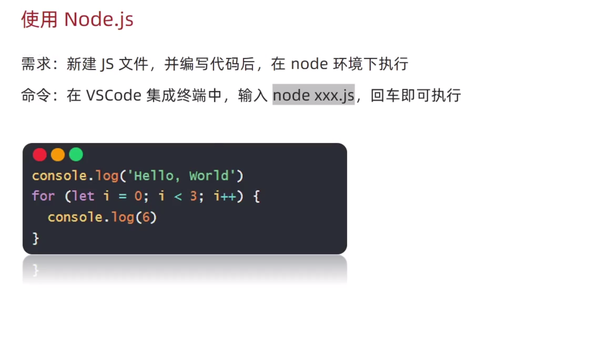
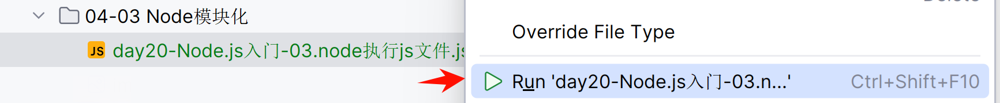
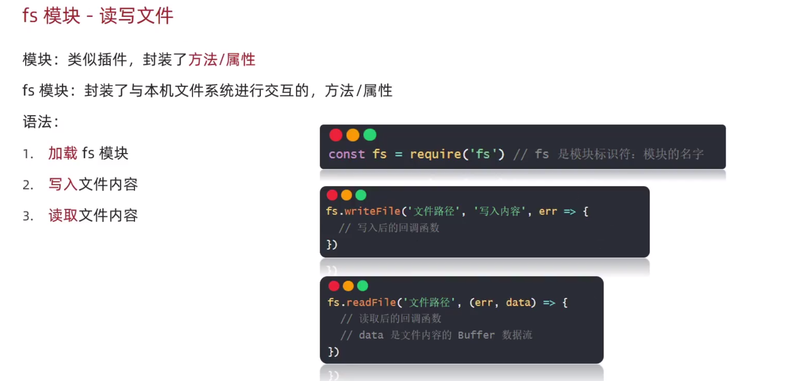
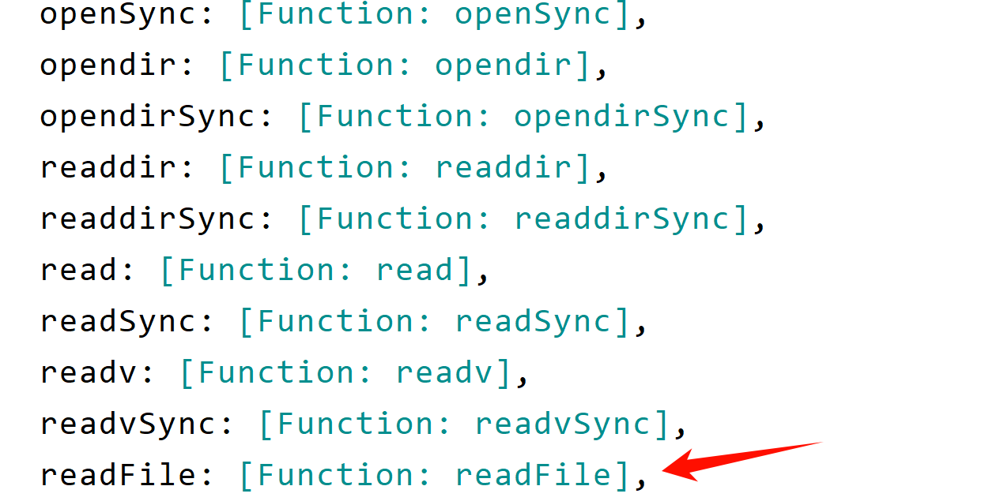

## 04-03 Node模块化

### 1. 目录



### 2. Node.js学习目录


#### 2.1 什么是Node.js



#### 2.2 Node.js为何能执行JS代码?

```html
  Node中是没有 DOM 和 BOM 的,JS 代码是运行在终端里面的,浏览器中是有页面元素的
但是Node中没有, 所以Node.js中是没有DOM 和 BOM 的,你没有办法操作标签,
也没有办法操作浏览器,也就不支持xhr对象.
  取而代之的是多了些自己新的模块,比如:fs操作文件模块, path 路径模块
http协议模块等.

```

#### 2.3 Node.js安装




#### 2.4 使用Node.js执行JS文件





```命令 node xxx.js```

#### 2.5 fs模介块绍


[day20-Node.js入门-04.fs模块介绍](day20-Node.js入门-04.fs模块介绍/demo04.js)



