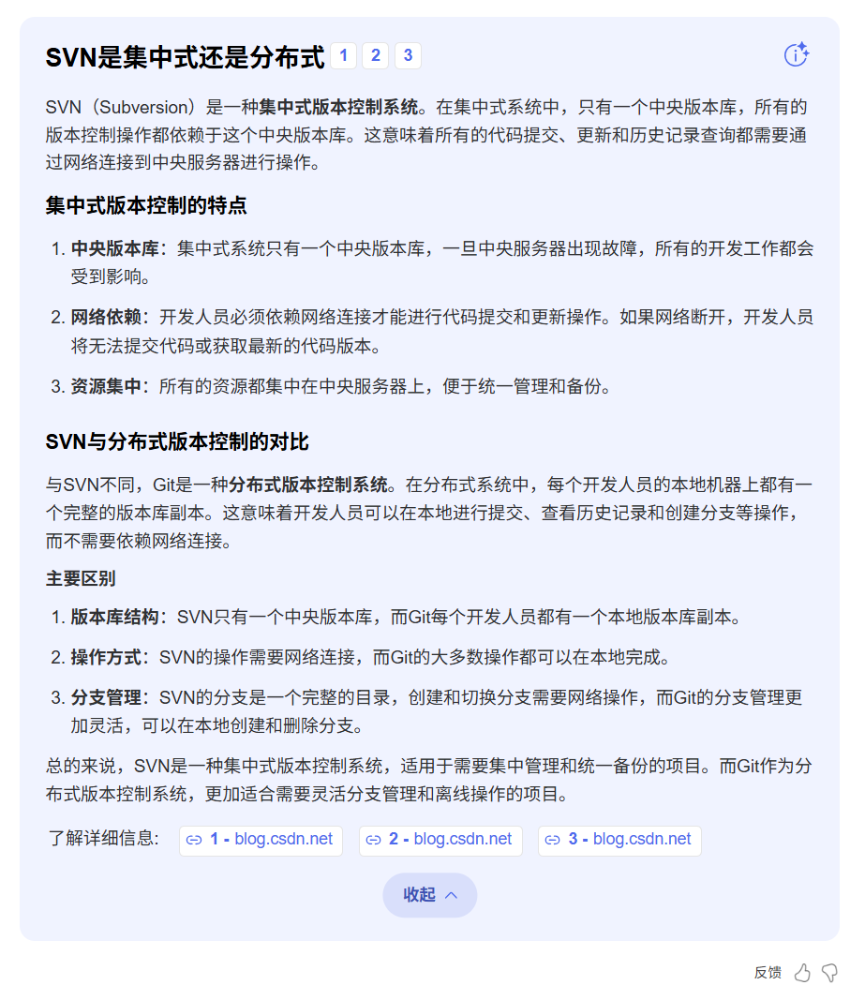
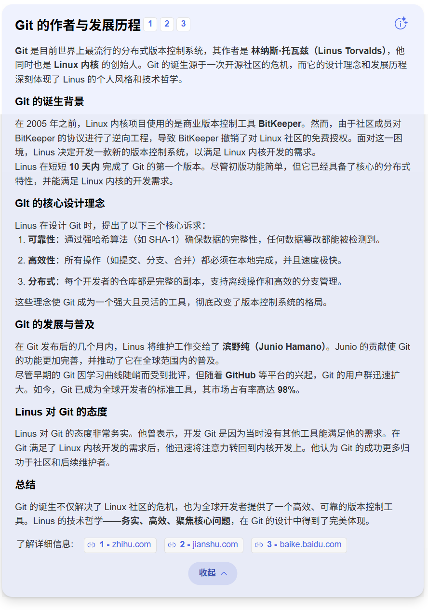
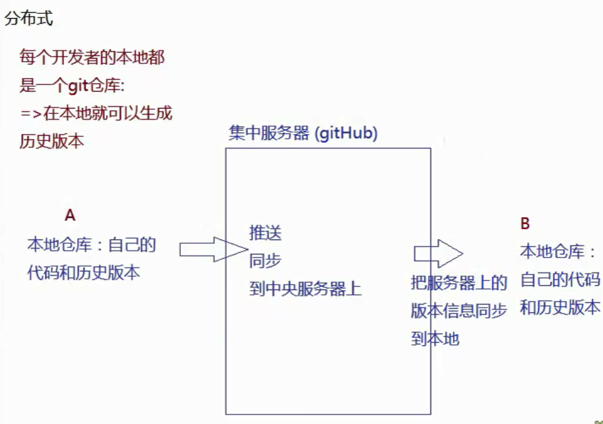

# Git是什么
我非常喜欢使用**GIT**  
*git的学习笔记*  
> git是一个分布式代码版本管理控制系统
>- 记录当前产品代码的所有版本信息(历史修改信息)，而且方便快速回退到某个具体的版本
>- 方便团队协作开发，能够检测代码冲突，能够合并代码等

***svn***:在`git`之前就已经存在的版本控制系统，不过它是**集中式**管理 
1. 集中式需要一台中央服务器。
2. 所有的代码都在中央服务器中存储，各种版本信息也存储在其中。

***git***:是`分布式`版本管理系统
1. 举例：CDN就是分布式管理。
2. 每个开发者的在本地都有一个git仓库。
3. 不需要连接中央服务器，在本地就可以生成历史版本。
4. 不需要连接中央服务器，本地就可以实现回滚，对比，合并等操作。

# Git的作者是 linux的创始人

