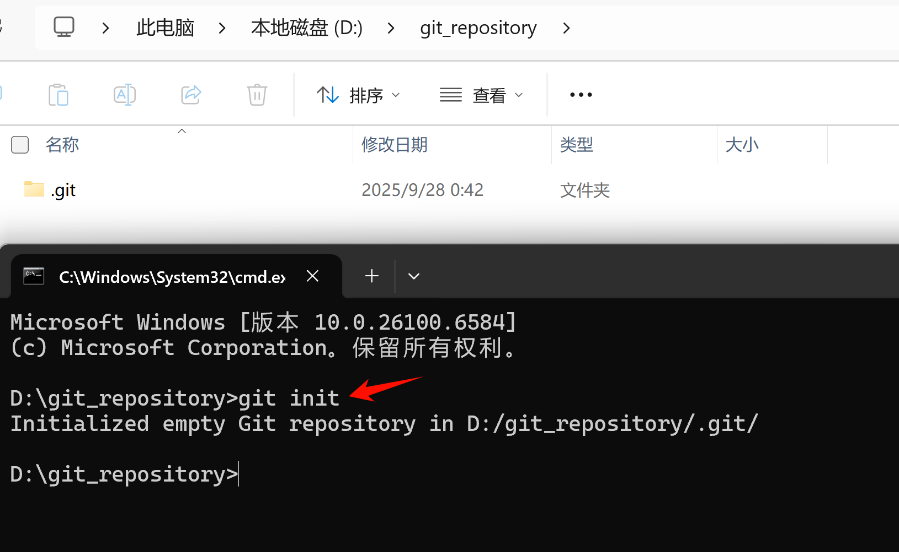
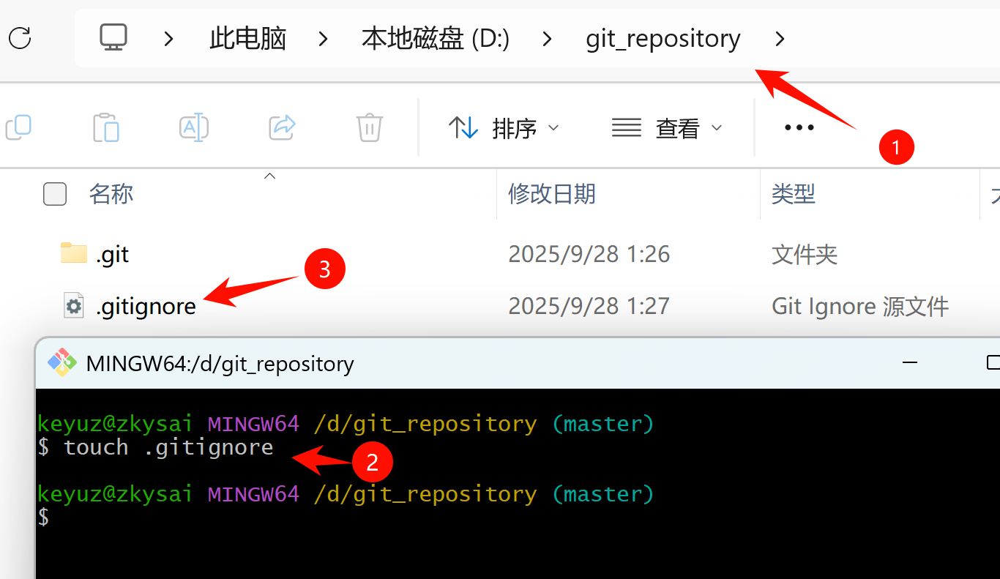
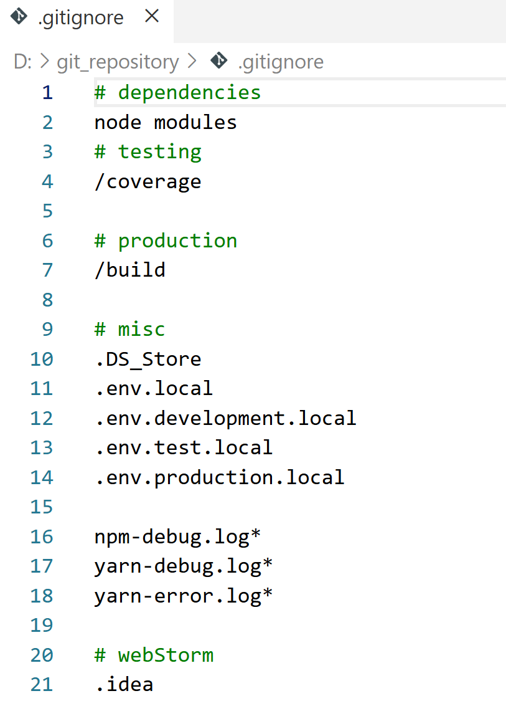
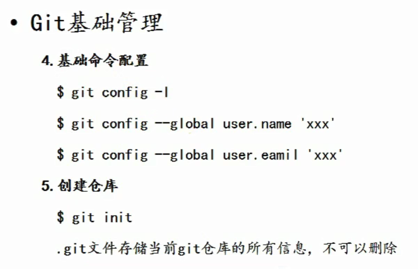

### Git的工作管理和基础操作
```
前文回顾

我们之前说了，每个人的电脑都是要给git仓库，每个人的本地电脑上都可以完成版本信息的记录（历史信息的记录），
我们就可以通过git操作（命令）从本地的某一个历史区，将代码的某个版本回滚回来。
或者做一些代码之间的对比操作。

接下来：我们就重点讲一下：
    如何在本地创建一个git仓库，提交代码 完成历史版本记录。
```
---
#### 在本地创建git仓库管理我们的代码
> 初次使用git之前，我们先在本地配置一些基础信息：用户名 和 邮箱
>     
> 1. git config -l 
> 
> 初次使用没有`user.name` `user.email`
> 2. 配置用户名: git config --global user.name "你的名字"
> 3. 配置邮箱  : git config --global user.email "你的邮箱"
> 4. 配置完成后，我们就可以基于这个配置在本地建立一个仓库了。
> 5. 注意：建议大家配置的用户名和邮箱和github的保持一致(这样以后在本地向gitHub推送内容的时候，能够展示出是谁推荐的,然后你点他的名字，就能进入他的个人中心了)


#### 创建仓库
> 代码：git init
> 1. 在d盘新建 git_repository 目录，D:\git_repository
> 2. 在路径上输入cmd
> 3. `输入git init`
>>通过这个操作，会在当前目录中生成一个空仓库，文件目录中会生成一个".git"的隐藏目录(这个目录不能删，删了就不是git仓库了，所有提交的所有文件的历史信息都存储在这个目录里面)
> 4. 
> 5. `.gitignore文件`
>> touch .gitignore | window系统右键手动生成也可以
>> 在当前目录（git仓库根目录）创建一个".gitignore"忽略文件，这个文件没有文件名，只有后缀名，这个文件中存储了当git提交的时候所忽略的文件
>> 
>> 
```
# dependencies
node modules
# testing
/coverage

# production
/build

# misc
.DS_Store
.env.local
.env.development.local
.env.test.local
.env.production.local

npm-debug.log*
yarn-debug.log*
yarn-error.log*

# webStorm
.idea
```

```
这个文件中的# xxx是注释没有意义
```
#### git基础操作的代码图片
> 


<style>
    h3,h4{
        color: #31516B;
    }

    code{
        display: inline-block;
        padding: 1px 4px;
        font-size: 16px;
        color:rgba(199,37,78);
        background-color:rgba(249,242,244);
        letter-spacing: 1px;
    }

    li:nth-of-type(4){
        color:rgba(199,37,78);
        background-color:rgba(249,242,244);
    }

    .span-red{
        display: inline-block;
        padding: 1px 4px;
        font-size: 16px;
        color:rgba(199,37,78);
        background-color:rgba(249,242,244);
        letter-spacing: 1px;
    }   
</style>
