### git的工作流程
```
前文回顾

```
---
#### 创建一个1.js并在node中运行
> 1. git init创建一个空仓库
> 2. 新建一个.gitignore 文件，并配置忽略的文件或文件夹    
> 3. `书写一个1.js，并在node中运行`
> 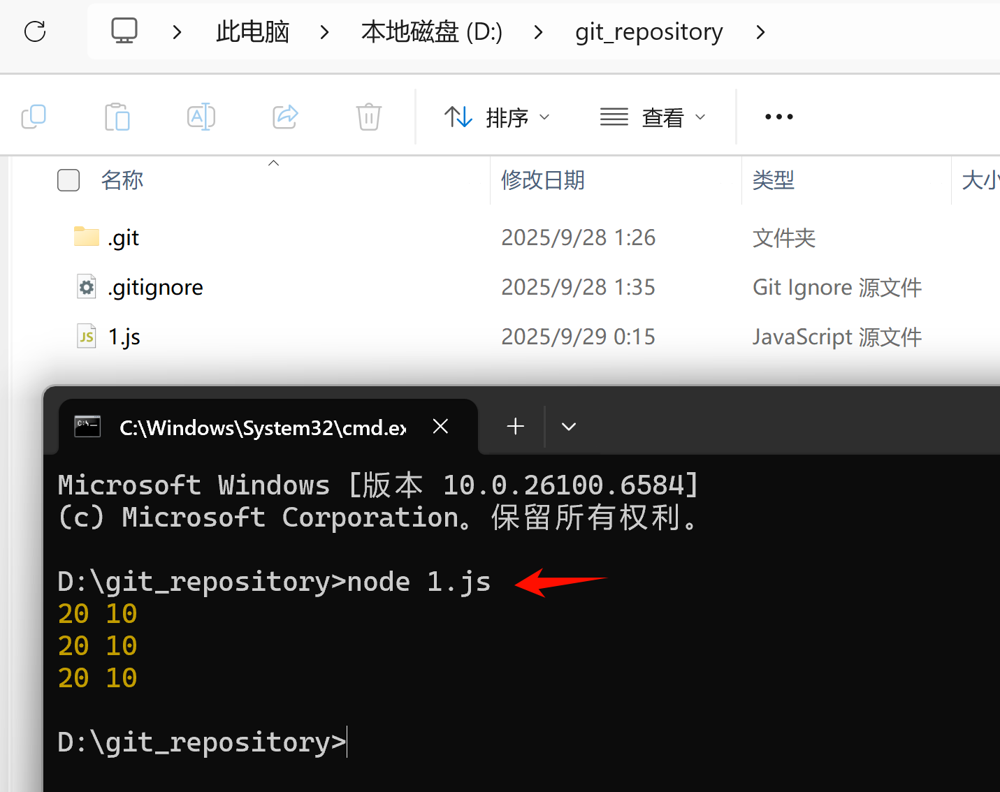
> 
```
当我们在本地创建一个git仓库后，我们可以基于
这个仓库管理我们的代码
```
#### git的工作流程
> 每一个git仓库都划分为三个区域
> - 工作区：编辑代码的地方
> - 暂存区：临时存储要生成版本代码的地方(要放入历史区之前，先放入暂存区)
> - 历史区：存储的是生成的每个版本代码
> 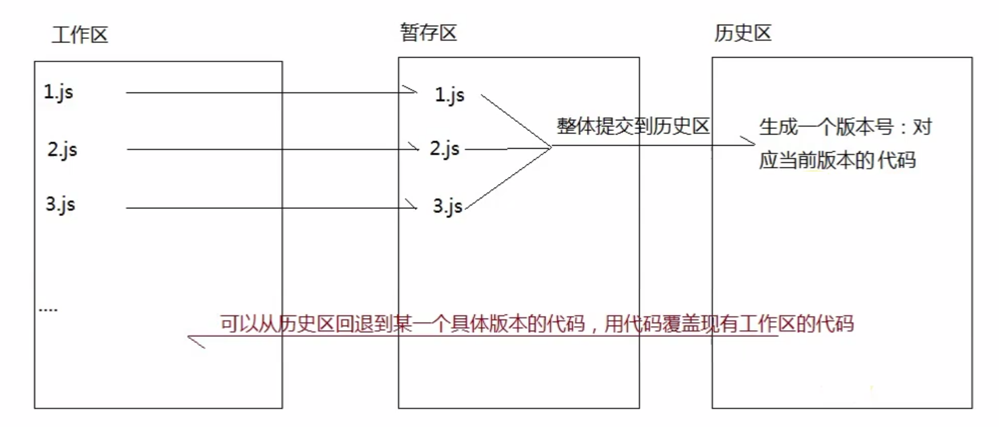
>
> git的工作流程:git有三个区 => 第一个是工作区，第二个是暂存区，
第三个是历史区。`我现在要做一个特别大的功能，并且想把那大功能
生成个一个历史版本。`但是这个大功能我可能得需要写3天，假设第一天我在工作区里边
新做了一个文件叫1.js,这个js经完成一个功能了。第一天我是不是写了1.js
`那你发现这1.js把大功能完成了吗？那我想生成历史版本吗?并不想。
我只想把它彻底完成了，我才想生成历史版本。`那怎么办呢？所以说你看，
我第一天结束了，我只写了一部分，对不对？我就可以暂时把它提交到暂存区里，
也就是说会往暂存区里提交了一个1.js。是不是现在有了一个1.js了吧.
好？那往历史区去提了吗？还没有。
> 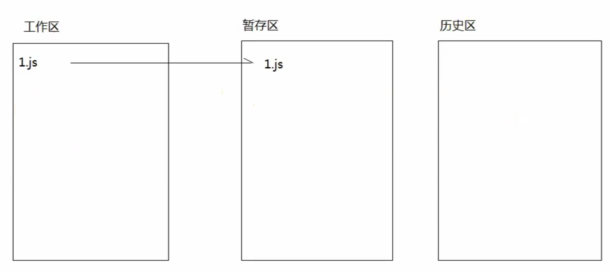
> 
> - 第二天，我又创建了一个2.js，又完成了一个功能，之后， 我要把这个2.js也提交到暂存区。
> 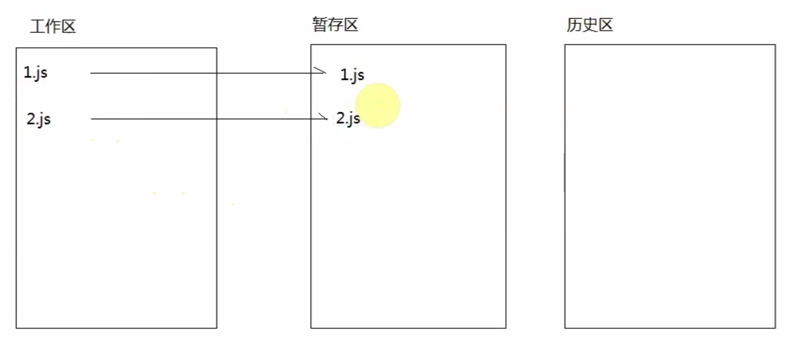
> - 这是我们暂存区的2.js，那此时只写代，有历史版本吗？都没有。
> - 第三天，我又写一个功能存储到3.js中。好了，现在发现这个大功能彻底完成了。
我说的是一个大功能啊，但是一个项目是不是有n多大功能组成了吧。
一个大功能完成了，我把它也提交到暂存区。
> 
`那现在大功能完成了，我是要把这个整个大功整体提交到历史区。
把暂存区内容整体提交到历史区。`
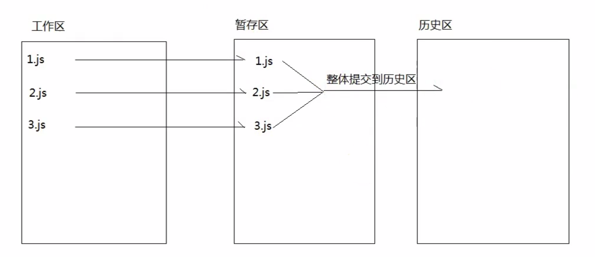
> - 提交到历史区咋办？？生成一个版本号，对应当前版本的代码
> 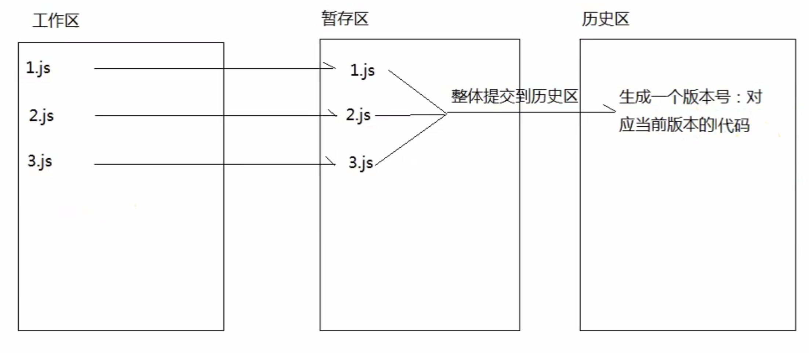
> - 以后再开发的时候,依次执行这个流程。我需要开发很多内容，
而这些内容，我一天做不完，那我就先把做完的功能存储到git的暂存区，
最后，我发现这个功能彻底做完了之后，咱们再把暂存区代码整体交到历史区,
生成一个历史版本。 这样的话，你发现历史区的每一个版本对应的代码
相对来说，都是比较完整的。`这就是为什么git要比svn多一个暂存区`
>
> - 而svn是没有暂存区的，svn是我今天做完了多少就把代码提交到中央服务器，提一次
生成一个历史版本，但这个历史版本一定是一个完整的代码功能吗？不一定。
但后来这的话，开发git的人就发现了，使用svn提交代码的习惯和我们开发者的行为习惯
其实不一样。 
> 如果一个月之后，代码改了很多，突然发现，现在改的代码有问题，想看看之前是怎么做的
可以使用git命令回退到历史区的某一个版本号。看看之前是怎么做的，如果发现做的好，可以把
代码迁移出来。
`总结：历史区会生成好多历史版本，有很多的版本号，当然有一天我发现代码的功能有问题，
我想回退到之前的某个版本号。可以通过一个操作，把某一个版本的代码从历史区直接把回退
到工作区，用历史区某一个版本代码覆盖工作区的内容。`
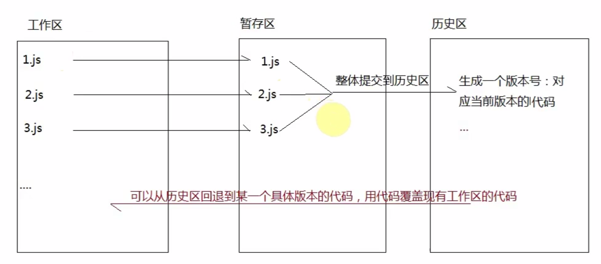
`可以从历史区回退到某一个具体版本代码，然后用什么用历史区的代码覆盖现有工作区的代码。
第一阶段我们不讲怎么回退。当然里边还有冲突检测等好多事，咱们今天先不讲那么深。
那现在干什么呢？`

#### 从工作区添加到暂存区
> 
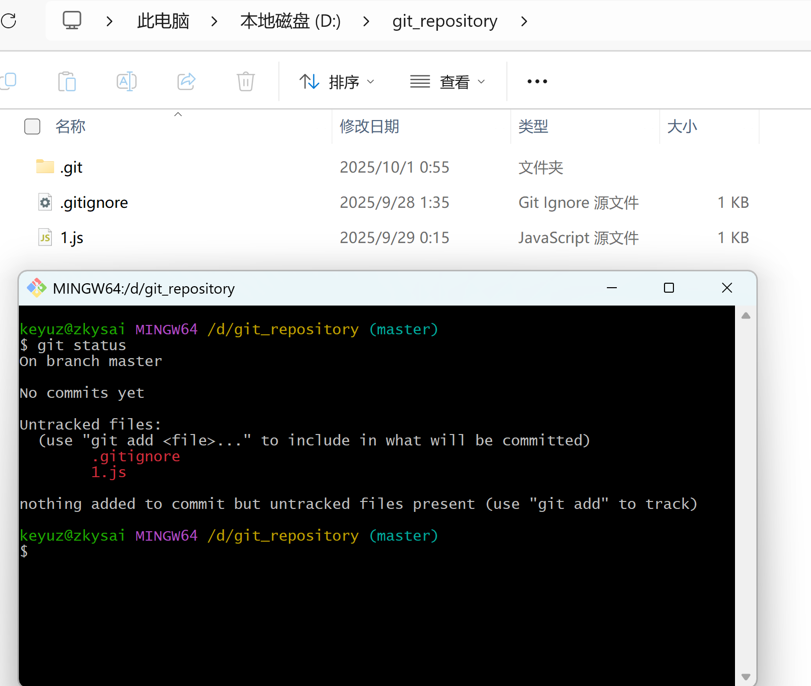
>- git status
```
使用git status 命令查看代码或文件的状态(就是代码或文件处于哪个区域)
keyuz@zkysai MINGw64 /d/git_repository (master)
$ git status
On branch master
No commits yet
untracked files:
    (use "git add <file>..." to include in what will be committed)
        .gitignore
        1.js
nothing added to commit but untracked files present (use "git add" to track)

查看代码或者文件的状态（当前处于哪个区域）：
红色的文件 (代表当前的文件处于工作区，还没有提交到暂存区)
绿色的文件 (代表当前的文件处于暂存区，还没有提交到历史区)
如果没有文件，代表三个区域代码已经同步，历史版本也在历史区生成了
```
>- git add 文件名
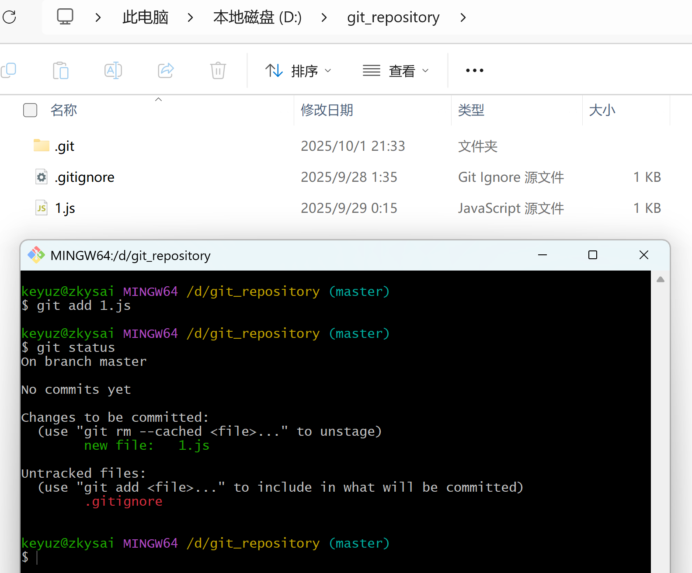
```
keyuz@zkysai MINGW64 /d/git_repository (master)
$ git add 1.js

keyuz@zkysai MINGW64 /d/git_repository (master)
$ git status
On branch master

No commits yet

Changes to be committed:
  (use "git rm --cached <file>..." to unstage)
        new file:   1.js

Untracked files:
  (use "git add <file>..." to include in what will be committed)
        .gitignore
```

```
keyuz@zkysai MINGW64 /d/git_repository (master)
$ git add .gitignore

keyuz@zkysai MINGW64 /d/git_repository (master)
$ git status
On branch master

No commits yet

Changes to be committed:
  (use "git rm --cached <file>..." to unstage)
        new file:   .gitignore
        new file:   1.js
```

>- git rm  --cached <file> 将文件从暂存区删除
> 
```
keyuz@zkysai MINGW64 /d/git_repository (master)
$ git rm --cached 1.js
rm '1.js'

keyuz@zkysai MINGW64 /d/git_repository (master)
$ git status
On branch master

No commits yet

Changes to be committed:
  (use "git rm --cached <file>..." to unstage)
        new file:   .gitignore

Untracked files:
  (use "git add <file>..." to include in what will be committed)
        1.js
```
>- git add -A

```
keyuz@zkysai MINGW64 /d/git_repository (master)
$ git add -A

keyuz@zkysai MINGW64 /d/git_repository (master)
$ git status
On branch master

No commits yet

Changes to be committed:
(use "git rm --cached <file>..." to unstage)
new file:   .gitignore
new file:   1.js
```
>- git add . / git add -A
把当前工作区中所有最新修改的文件，都提交到暂存区

`工作区提交到暂存区，暂存区提交到历史区(重点记住暂存区始终存放提交的内容，
并没有消失，以后工作区内容修改，会和暂存区作对比，依此来判断哪些是新处理的）`
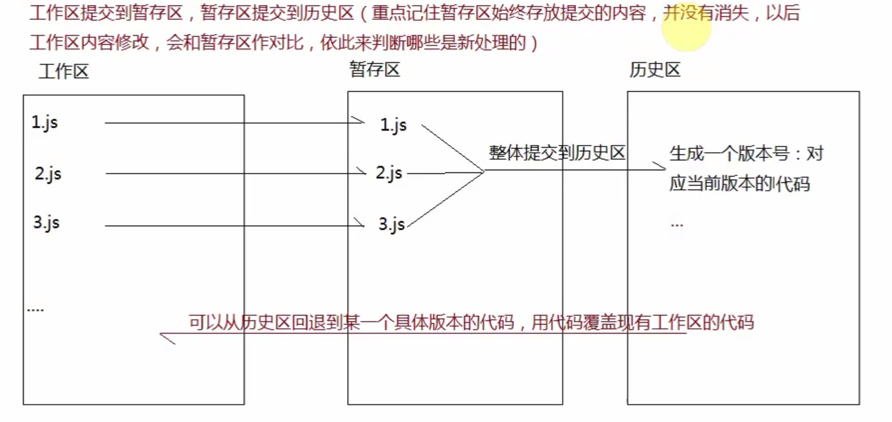


>- 新增 2.js 和 3.js文件，将1.js删除,输入git status查看状态

```
keyuz@zkysai MINGW64 /d/git_repository (master)
$ git status
On branch master

No commits yet

Changes to be committed:
  (use "git rm --cached <file>..." to unstage)
        new file:   .gitignore
        new file:   1.js

Changes not staged for commit:
  (use "git add/rm <file>..." to update what will be committed)
  (use "git restore <file>..." to discard changes in working directory)
        deleted:    1.js

Untracked files:
  (use "git add <file>..." to include in what will be committed)
        2.js
        3.js
```

>- 执行git add . 和 git status


>- 执行git add -A 和 git status
此时暂存区中的1.js没有了。


#### 从暂存区提交到历史区

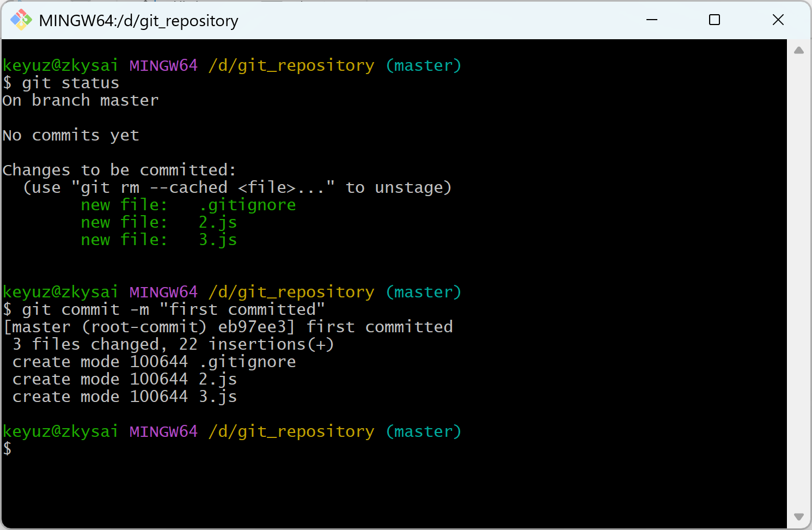

```
keyuz@zkysai MINGW64 /d/git_repository (master)
$ git status
On branch master

No commits yet

Changes to be committed:
  (use "git rm --cached <file>..." to unstage)
        new file:   .gitignore
        new file:   2.js
        new file:   3.js

keyuz@zkysai MINGW64 /d/git_repository (master)
$ git commit -m "first committed"
[master (root-commit) eb97ee3] first committed
 3 files changed, 22 insertions(+)
 create mode 100644 .gitignore
 create mode 100644 2.js
 create mode 100644 3.js
```

#### git和github同步
> 1.让本地的git仓库和远程仓库建立关联
```
git remote -v 查看所有的关联信息:没有信息说明当前本地仓库和所有的远程仓库没有关联
```
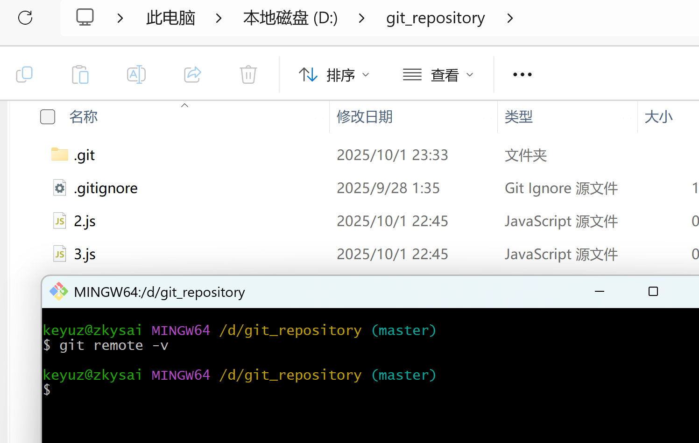
```
git remote add 远程仓库名 [远程仓库git地址]     =>建立关联

git remote remove xxx                         =>移除关联

我们远程仓库关联再一起的名字默认是：origin。当然自己可以随意修改。

git remote add origin https://github.com/zkysai/test123.git
```

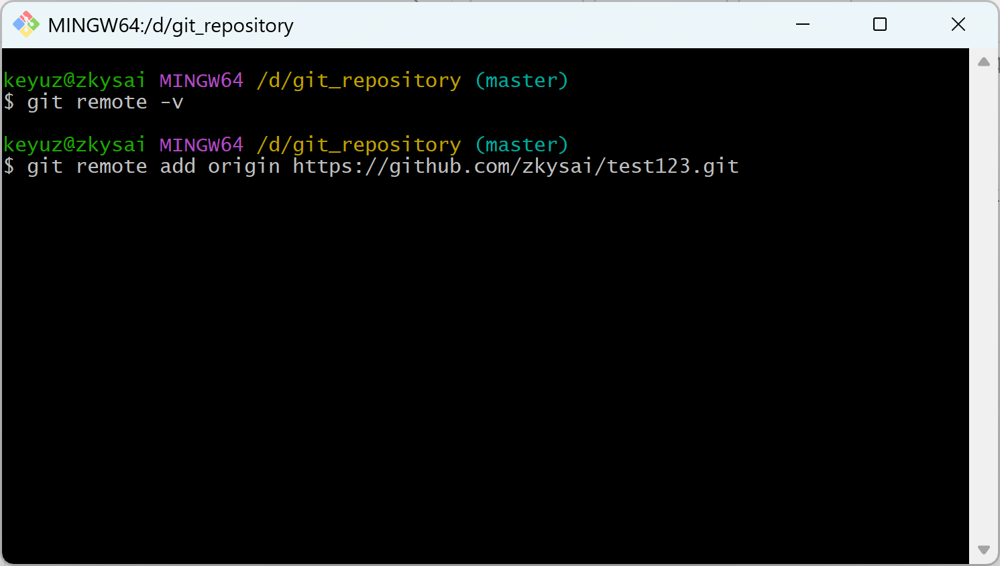
```
keyuz@zkysai MINGW64 /d/git_repository (master)
$ git remote add origin https://github.com/zkysai/test123.git

keyuz@zkysai MINGW64 /d/git_repository (master)
$ git remote -v
origin  https://github.com/zkysai/test123.git (fetch)
origin  https://github.com/zkysai/test123.git (push)
```
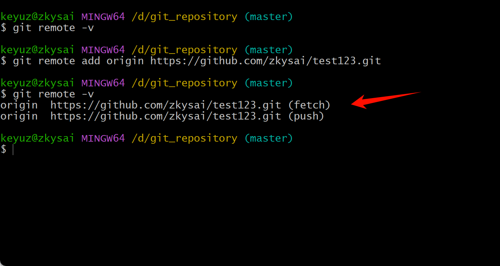

> 2.把本地的信息推送到远程仓库上，或者从远程仓库上拉去最新的信息到本地仓库

> git remote remove origin 删除本地仓库和 远程仓库的关联
```
我们本地推送和拉去的信息，既有代码也有版本信息，所以，与其说是推送和拉去，不如说
是和远程仓库保持信息同步
```

在推送之前，我们都应该先拉取
git pull origin （这个名字就是和远程仓库关联的这个名字，以自己设置的为主）master
从远程仓库的master分支拉取最新的信息

git push origin master 将自己本地的信息推送到远程仓库的master分支下

git pull / git push

弹出一个窗口这里要输入github的用户名和密码。


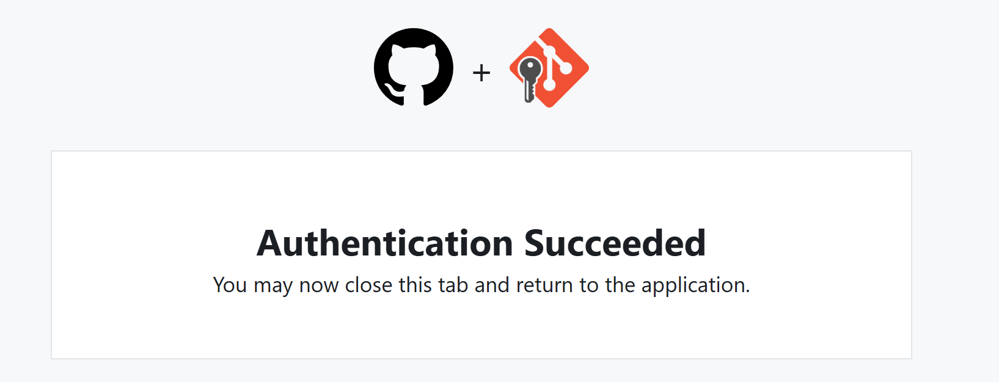
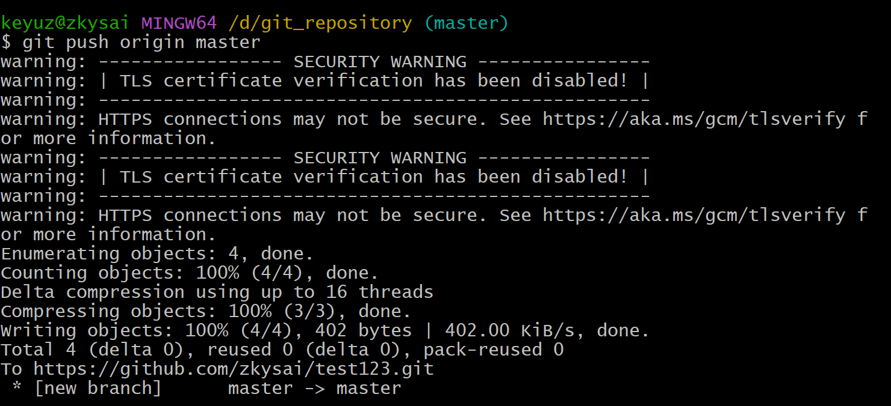
```
keyuz@zkysai MINGW64 /d/git_repository (master)
$ git push origin master
warning: ----------------- SECURITY WARNING ----------------
warning: | TLS certificate verification has been disabled! |
warning: ---------------------------------------------------
warning: HTTPS connections may not be secure. See https://aka.ms/gcm/tlsverify for more information.
warning: ----------------- SECURITY WARNING ----------------
warning: | TLS certificate verification has been disabled! |
warning: ---------------------------------------------------
warning: HTTPS connections may not be secure. See https://aka.ms/gcm/tlsverify for more information.
Enumerating objects: 4, done.
Counting objects: 100% (4/4), done.
Delta compression using up to 16 threads
Compressing objects: 100% (3/3), done.
Writing objects: 100% (4/4), 402 bytes | 402.00 KiB/s, done.
Total 4 (delta 0), reused 0 (delta 0), pack-reused 0
To https://github.com/zkysai/test123.git
 * [new branch]      master -> master
```

```
http://localhost:27119/?code=7e1d549d1b423f397cb6&state=eeccbfb8f6c54a41ae0068fb0b5aa2f4
```
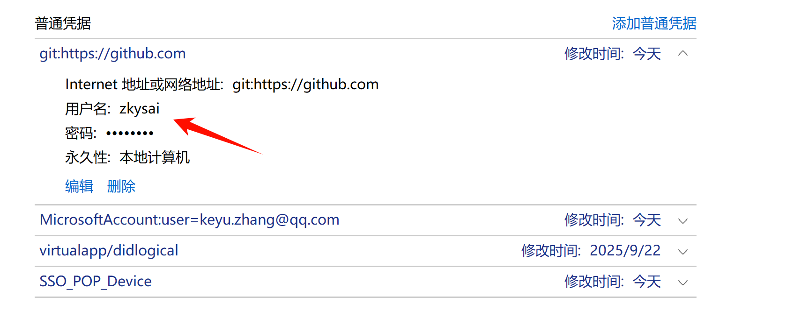

> 克隆一个仓库，并取名为git_repository3
git clone https://github.com/zkysai/test123.git git_repository3
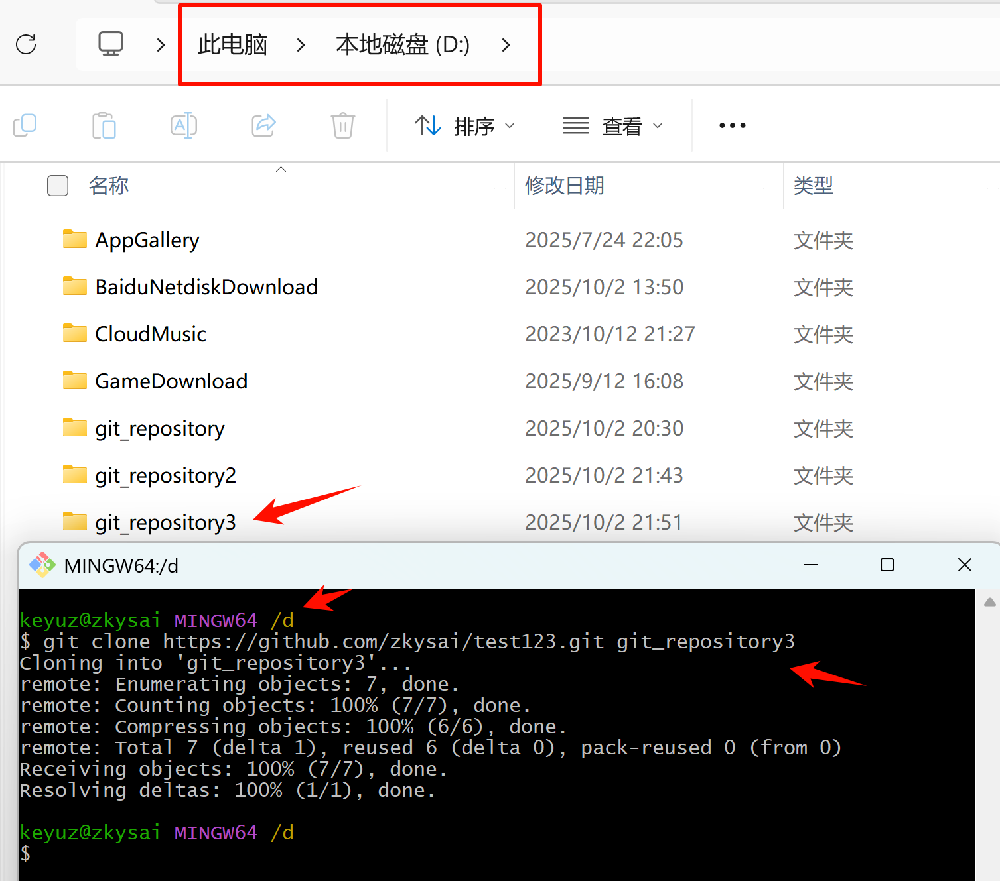

> 团队协作 
在团队协作开发的时候，LEADER会在自己的
gitHub账号下创建一个远程仓库，那么团队其他
成员在向这个远程仓库推送信息的时候，使用自
己的账号是没有推送权限的，我们需要把当前这
个远程仓库，在github中创建工作群组，让更多
人用自己的账号也有操作权限

>
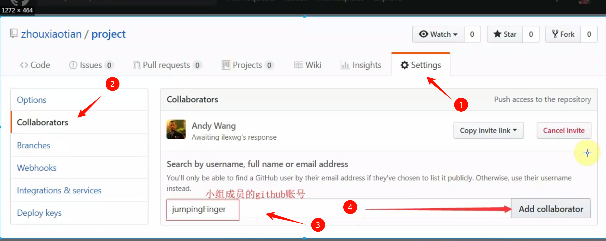

<style>
    h3,h4{
        color: #31516B;
    }

    code{
        display: inline-block;
        padding: 1px 4px;
        font-size: 16px;
        color:rgba(199,37,78);
        background-color:rgba(249,242,244);
        letter-spacing: 1px;
    }

    ul:nth-of-type(1)>li:nth-of-type(4){
        color:rgba(199,37,78);
        background-color:rgba(249,242,244);
    }

    .span-red{
        display: inline-block;
        padding: 1px 4px;
        font-size: 16px;
        color:rgba(199,37,78);
        background-color:rgba(249,242,244);
        letter-spacing: 1px;
    }   
</style>
