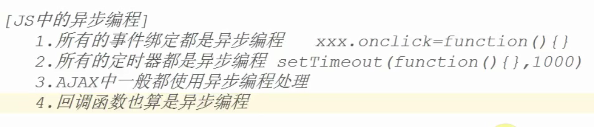
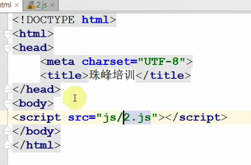
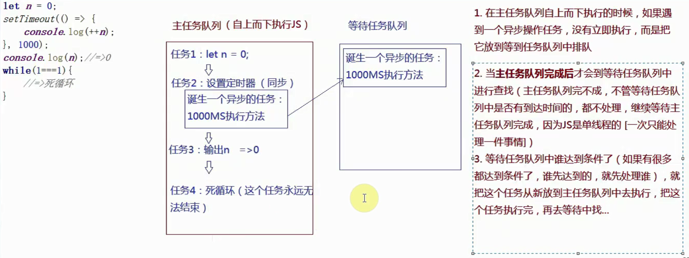

### 异步编程原理
- JS中的异步编程

  > 1. 所有的事件绑定都是异步编程xxx.onclick=function(){} 
  > 2. 所有的定时器都是异步编程setTimeout（function（）{},1000)
  > 3. AJAX中一般都使用异步编程处理
  > 4. 回调函数也算是异步编程

- 浏览器中的异步编程（讲的有问题）
  > 浏览器加载页面大体分为2个阶段: `1. DOM tree阶段` `2.`
  > DOM Tree怎么做？ 比如这是我的页面
它怎么进入DOM Tree呢？代码是从头走到尾，走完之后，计算出DOM的层级结构。
这个过程中，可能就会遇到link标签 script标签 或是 img标签，此时计算DOM树的同时，
就开始加载js css img文件了，注意是 加载css 而不是渲染css，加载css，至少从服务器
上把css文件下载到本地。下载这些资源的同时，还是计算DOM树。拿完资源之后，再渲染DOM树。

- 浏览器是是如何规划同步异步机制的？
  > 1.浏览器是多线程的，JS是单线程的（浏览器只给JS执行分配一个线程）：单线
  程的特点就是一次只能处理一件事情。
  > 
  > 2.JS在单线程中实现异步的机制，主要依赖于浏览器的任务队列完成的。浏览器
  中有两个任务队列（主任务队列、等待任务队列）
  >
  > 3.

